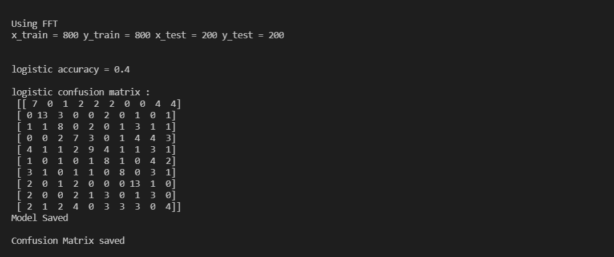

# Music_genre_recognition

I have used Logistic Regresssion in this project which is a Machine Learning classification algorithm that is often used to predict the probability of a categorical dependent variable, in this case to predict the genre of a given input song sample.  
It measures the relationship between the categorical dependent variable and one or more independent variables by estimating the probability of occurrence of an event using its logistics function. Logistic Regression is a linear classifier which is generally meant for binary classification tasks. For this multi-class classification task, Logistic Regression is implemented as a one-vs-rest method. That is, 10 separate binary classifiers are trained. During test time, the class with the highest probability from among the 10 classifiers is chosen as the predicted class. 
The dataset used in this project is the GTZAN dataset. It contains 10 genres, each represented by 100 tracks which are each 30 seconds long. The tracks are all 22050Hz Mono 16-bit audio files in .wav format. 
The dataset can be downloaded from http://marsyas.info/downloads/datasets.html

<h3>SEQUENCE OF EXECUTION</h3>
<h4>FEATURE EXTRACTION</h4>
This is achieved using the Fast Fourier Transform algorithm of scipy. Run <code>fft_extraction.py</code> to generate the feature set for all wav audio files and store them as numpy files in ./extracted_fft

<h4>TRAINING MODEL</h4>
Run <code>logreg.py extracted_fft</code> to split set into train and test subsets, apply Logistic Regression to train model, calculate prediction accuracy, save the model as <code> model.pkl </code> and the confusion matrix.
 
 

<h4>PREDICTING GENRE</h4>
Run <code>test.py ./</code> to load the saved model to predict the genre of the new input audio file.
 
 

